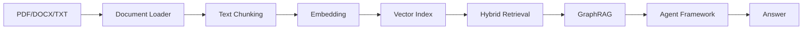
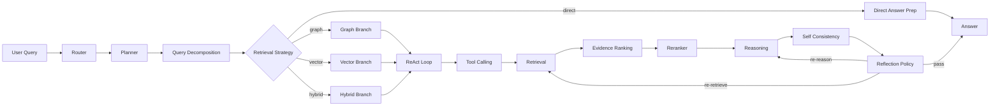
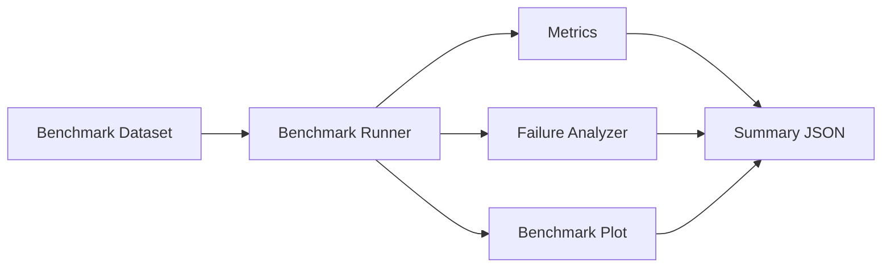

# 项目名称

**Legal Agentic GraphRAG**  
基于知识图谱与多智能体的法律问答系统

---

# 项目简介

本项目在原有 GraphRAG 与 Agentic 工作流基础上，升级为研究型 Agent Framework，支持：

- Hybrid RAG（向量检索 + 图谱检索）
- ReAct 推理与工具调用
- Reranker 重排序
- Self-Consistency 一致性推理
- 标准化基准评测（Agent Benchmark）
- 失败归因分析（Failure Analysis）
- 推理与评测可视化（Visualization）

---

# 系统架构



说明：`Router/Planner` 先决定 `retrieval_strategy`，再进入对应分支；`Reflection` 仍可回退到 `Retrieval` 或 `Reasoning`。

---

# Agent Reasoning Pipeline



---

# 动态检索策略（Dynamic Retrieval Strategy）

系统在 Router/Planner 阶段会先选择 `retrieval_strategy`，再由 `retrieval_agent` 执行对应检索：

- `graph`：法律条文适用、事实归责等图关系问题（默认）
- `vector`：定义/概念类问题
- `hybrid`：案例分析、争议焦点类问题
- `direct_answer`：通用寒暄或项目说明类问题（跳过检索）

这样可以在不改动整体工作流的前提下，按问题类型动态切换检索成本与召回方式。

检索链路职责已拆分为三层：

- Retrieval：只做召回与统一候选证据构造（`candidate_evidence`）
- Evidence Ranking：做第一层 coarse ranking（embedding similarity + 图特征 + 来源先验）
- Reranker：做第二层 deep reranking（CrossEncoder，可回退 lexical）

---

# LLM 与 Embedding 后端切换

系统支持两类 LLM 后端：

- 本地 `Ollama`（离线/私有部署）
- 云端 `Bailian(DashScope)` OpenAI 兼容 API（更快推理与评测）

通过环境变量切换：

- `LLM_PROVIDER=ollama` 或 `LLM_PROVIDER=bailian`
- `OLLAMA_BASE_URL / OLLAMA_MODEL`
- `DASHSCOPE_API_KEY / DASHSCOPE_BASE_URL / DASHSCOPE_MODEL`

Embedding 也支持双后端：

- `EMBEDDING_PROVIDER=local`：本地 `sentence-transformers`
- `EMBEDDING_PROVIDER=bailian`：DashScope Embedding API（`DASHSCOPE_EMBEDDING_MODEL`）

---

# 哪些模块使用 LLM

LLM 驱动（语义理解与生成）：

- Planner Agent：意图识别、是否检索/是否多跳推理、是否拆分问题
- Reasoning Agent：基于证据聚合生成推理步骤与中间结论
- Reflection Agent：评估证据充分性与推理一致性，决定是否回退
- Answer Agent：生成最终回答、证据摘要与不确定性说明

可选 LLM 辅助：

- Query Decomposer：LLM 拆分，规则回退
- Retrieval Strategy Selector：规则优先，规则不确定时再调用 LLM

保持确定性（非 LLM 主路径）：

- Graph / Vector / Hybrid Retrieval
- EvidenceRanker（统一打分）
- Reranker（CrossEncoder 或 lexical fallback）
- Graph Builder、实体归一化、图存储、评估指标

这样设计的好处：

- 可控性更强：检索与排序可复现、可解释
- 速度更稳定：高频检索链路不依赖大模型
- 评测更清晰：生成能力与检索能力可分层评估

---

# 数据扩充后 Prompt 工程如何调整

针对中文法律语料扩充（更多法条、案例摘要、多轮问答），Prompt 已分层组织到 `src/llm/prompts/`：

- 文档理解：`triple_extraction`
- 检索规划：`planner`、`retrieval_strategy`、`query_decomposition`、`query_rewrite`
- 推理反思：`reasoning`、`reflection`
- 回答生成：`answer`

改造目标是“可维护 + 可控”：

- Prompt 模板统一管理，避免散落在各 Agent 代码中
- 更强调 schema 约束与证据约束，降低幻觉
- 支持多轮对话中的追问改写，提升检索命中率

---

# Agent Benchmark

新增目录：`src/benchmark/`

- `dataset_loader.py`：加载标准基准集
- `benchmark_runner.py`：运行评测并输出汇总统计

基准数据：`data/benchmark/legal_benchmark.json`

指标：

- `entity_hit_rate`
- `evidence_path_hit_rate`
- `answer_keyword_match_rate`
- `latency`
- `reflection_trigger_rate`

运行：

```bash
python benchmark.py
```

输出包含：

- 指标汇总
- 样本级结果
- 失败样本列表
- 可视化图片路径

---

# Failure Analysis

新增：`src/analysis/failure_analyzer.py`

支持失败类型：

- `entity_linking_error`
- `retrieval_failure`
- `ranking_error`
- `reasoning_failure`
- `reflection_failure`

输出示例：

```json
{
  "query": "房屋租赁纠纷中，承租人逾期支付租金应承担什么责任？",
  "failure_type": "retrieval_failure",
  "details": "未找到足够相关的证据路径"
}
```

---

# Visualization

新增目录：`src/visualization/`

1. `reasoning_visualizer.py`

- 推理树（reasoning tree）
- 证据路径图（evidence path graph）

2. `benchmark_plot.py`

- 查询准确率曲线（accuracy over queries）
- 延迟分布（latency distribution）
- 反思触发频率（reflection trigger frequency）

使用库：`networkx`、`matplotlib`

---

# Evaluation Pipeline



---

# Demo 输出

`run_demo.py` 已展示：

- ReAct `Thought / Action / Observation`
- 工具调用
- 推理步骤
- 反思决策
- 置信分数
- 最终回答

内置中文演示问题：

- `盗窃行为通常适用哪一条法律条文？`
- `买卖合同违约时，法院通常如何认定违约责任？`
- `房屋租赁纠纷中，承租人逾期支付租金应承担什么责任？`

运行示例：

```bash
python run_demo.py --docs data/legal_docs/
```

---

# 项目结构

```text
src/
├─ agents/
├─ analysis/
│  └─ failure_analyzer.py
├─ benchmark/
│  ├─ dataset_loader.py
│  └─ benchmark_runner.py
├─ embedding/
├─ graph/
├─ ingestion/
├─ reasoning/
├─ retrieval/
├─ router/
├─ tools/
├─ vector_store/
└─ visualization/
   ├─ reasoning_visualizer.py
   └─ benchmark_plot.py
```

---

# 依赖

- sentence-transformers
- faiss-cpu
- pdfplumber
- python-docx
- transformers
- networkx
- matplotlib

---

# 说明

本次升级为增量扩展：

- 未移除旧模块
- 保持原有 GraphRAG 可运行
- 新增研究型评测、失败分析与可视化能力

---

# 图谱抽取升级（规则 + LLM）

当前图谱构建采用三层策略：

1. 规则抽取：稳定提取中文法条、罪名、责任与主体信息。  
2. LLM 三元组抽取：通过本地 Ollama 模型补充复杂关系（如 `APPLIES_TO`、`CITES`）。  
3. 规范化融合：对实体类型、关系类型和三元组做校验去重后合并入图。  

设计原因：

- 保留规则抽取：保证在模型不可用时系统仍可运行。  
- 增加 LLM 抽取：提升复杂法律语义关系覆盖。  
- 强制校验：减少幻觉与脏数据进入图谱。  

当 Ollama 不可用时，系统会自动退回规则抽取路径，不影响整体流程可用性。
