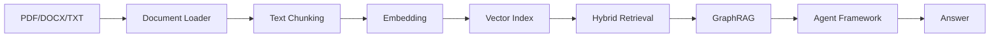
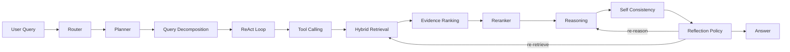
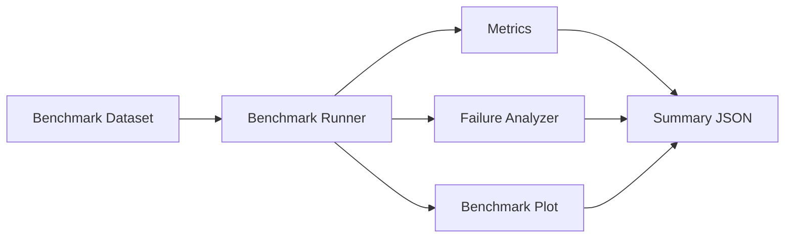

# 项目名称

**Legal Agentic GraphRAG**  
基于知识图谱与多智能体的法律问答系统

---

# 项目简介

本项目在原有 GraphRAG 与 Agentic 工作流基础上，升级为研究型 Agent Framework，支持：

- Hybrid RAG（向量检索 + 图谱检索）
- ReAct 推理与工具调用
- Reranker 重排序
- Self-Consistency 一致性推理
- 标准化基准评测（Agent Benchmark）
- 失败归因分析（Failure Analysis）
- 推理与评测可视化（Visualization）

---

# 系统架构



---

# Agent Reasoning Pipeline



---

# Agent Benchmark

新增目录：`src/benchmark/`

- `dataset_loader.py`：加载标准基准集
- `benchmark_runner.py`：运行评测并输出汇总统计

基准数据：`data/benchmark/legal_benchmark.json`

指标：

- `entity_hit_rate`
- `evidence_path_hit_rate`
- `answer_keyword_match_rate`
- `latency`
- `reflection_trigger_rate`

运行：

```bash
python benchmark.py
```

输出包含：

- 指标汇总
- 样本级结果
- 失败样本列表
- 可视化图片路径

---

# Failure Analysis

新增：`src/analysis/failure_analyzer.py`

支持失败类型：

- `entity_linking_error`
- `retrieval_failure`
- `ranking_error`
- `reasoning_failure`
- `reflection_failure`

输出示例：

```json
{
  "query": "...",
  "failure_type": "retrieval_failure",
  "details": "no relevant graph path found"
}
```

---

# Visualization

新增目录：`src/visualization/`

1. `reasoning_visualizer.py`

- 推理树（reasoning tree）
- 证据路径图（evidence path graph）

2. `benchmark_plot.py`

- 查询准确率曲线（accuracy over queries）
- 延迟分布（latency distribution）
- 反思触发频率（reflection trigger frequency）

使用库：`networkx`、`matplotlib`

---

# Evaluation Pipeline



---

# Demo 输出

`run_demo.py` 已展示：

- ReAct `Thought / Action / Observation`
- tool calls
- reasoning steps
- reflection decision
- confidence score
- final answer

运行示例：

```bash
python run_demo.py --docs data/legal_docs/
```

---

# 项目结构

```text
src/
├─ agents/
├─ analysis/
│  └─ failure_analyzer.py
├─ benchmark/
│  ├─ dataset_loader.py
│  └─ benchmark_runner.py
├─ embedding/
├─ graph/
├─ ingestion/
├─ reasoning/
├─ retrieval/
├─ router/
├─ tools/
├─ vector_store/
└─ visualization/
   ├─ reasoning_visualizer.py
   └─ benchmark_plot.py
```

---

# 依赖

- sentence-transformers
- faiss-cpu
- pdfplumber
- python-docx
- transformers
- networkx
- matplotlib

---

# 说明

本次升级为增量扩展：

- 未移除旧模块
- 保持原有 GraphRAG 可运行
- 新增研究型评测、失败分析与可视化能力
